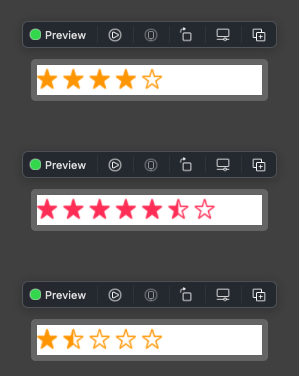

# StarRatingViewSwiftUI

This package provides you with an easy way to show / edit star rating as following screenshot.



You can add this package on Xcode.
See [documentation](https://developer.apple.com/documentation/swift_packages/adding_package_dependencies_to_your_app).


## How to Use

You can just import StarRatingViewSwiftUI to use the package.

```swift
  StarRatingView(rating: 4)
    .frame(width: 300, height: 30)
```

```swift
  StarRatingView(rating: 5.5, color: .pink, maxRating: 7)
    .frame(width: 300, height: 30)
```

```swift
  @State var rating: Float = 1.5

  StarRatingView(rating: $rating)
    .onChange(of: rating) { newRating in
      print(newRating)
    }
    .frame(width: 300, height: 30)
```

## License

This package is licensed under [BSD License](LICENSE)
